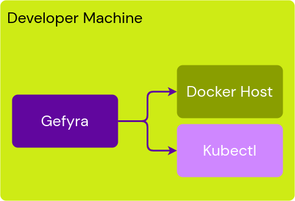
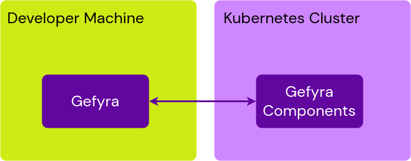
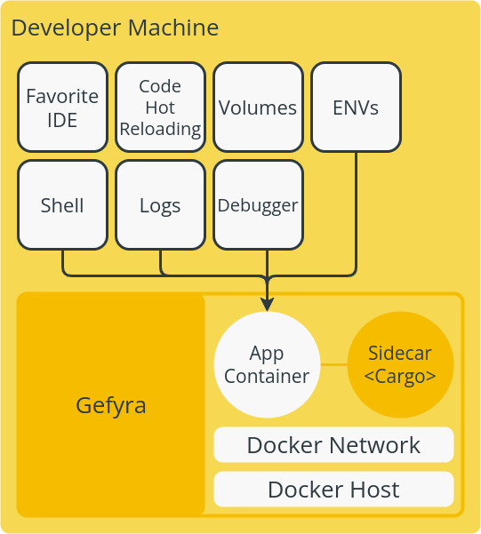
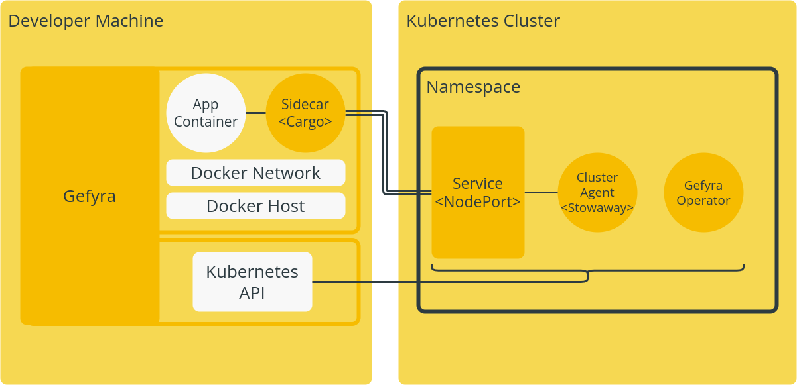
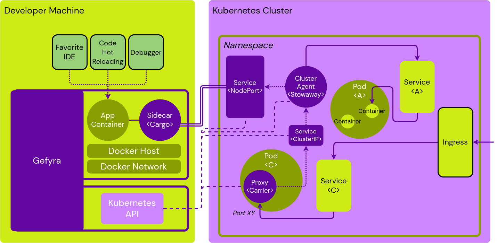

# Gefyra
Gefyra gives developers a completely new way of writing and testing their applications. Over are the times
of custom Docker-compose setups, Vagrants, custom scrips or other scenarios in order to develop (micro-)services
for Kubernetes.  

Gefyra offers you to:
- run services locally on a developer machine
- operate feature-branches in production-like Kubernetes environment with all adjacent services
- write code in the IDE you already love, be fast, be confident
- leverage all the neat development features, such as debugger, code-hot-reloading, override ENVs
- run high-level integration tests against all dependant services
- keep peace-of-mind when pushing new code to the integration environment 

Gefyra was architected to be fast and robust on an average developer machine including most platforms.

## What is Gefyra?
Gefyra is a toolkit written in Python to arrange a local development setup in order to produce software for and with 
Kubernetes while having fun. It is installed on any development computer and starts its work if it is asked. Gefyra runs
as user-space application and controls the local Docker host and Kubernetes via _Kubernetes Python Client_. 

  

(_Kubectl_ is not really required but makes sense to be in this picture)

In order for this to work, a few requirements have to be satisfied:
- a Docker host must be available for the user on the development machine
- there are a few container capabilities required on both sides, within the Kubernetes cluster and on the local computer
- a node port must be opened up on the development cluster for the duration of the development work 

Gefyra intercepts the target application running in the cluster and tunnels all traffic hitting said container to the one running 
locally. Now, developers can add new code, fix bugs or simply introspect the traffic and run it right away in the Kubernetes cluster. 
Gefyra proves the entire infrastructure to do so and provides a high level of developer convenience. 

## Did I hear developer convenience?
The idea is to relieve developers from the stress with containers to go back and forth to the integration system. Instead, take
the integration system closer to the developer and make the development cycles as short as possible. No more waiting for the CI to complete
just to see the service failing on the first request. Cloud-native (or Kubernetes-native) technologies have completely changed the 
developer experience: Infrastructure is increasingly becoming part of developer's business with all the barriers and obstacles.  
Gefyra is here to provide a development workflow with the highest convenience possible. It brings low setup times, rapid development, 
high release cadence and super-satisfied managers.

## Installation
Todo

## How does it work?
In order to write software for and with Kubernetes, obviously a Kubernetes cluster is required. There are already a number of Kubernetes 
distribution available to run everything locally. A cloud-based Kubernetes cluster can be connected as well in order to spare the development
computer from blasting off.
A working _KUBECONFIG_ connection is required with appropriate permissions which should always be the case for local clusters. Gefyra installs the required 
cluster-side components by itself once a development setup is about to be established.

With these component, Gefyra is able to control a local development machine, and the development cluster, too. Both sides a now in the hand of 
Gefyra.  
Once the developer's work is done, Gefyra well and truly removes all components from the cluster without leaving a trace.  

A few things are required in order to achieve this:
- a _tunnel_ between the local development machine and the Kubernetes cluster
- a local end of that tunnel to steer the traffic, DNS, and encrypt everything passing over the line
- a cluster end of the tunnel, forwarding traffic, taking care of the encryption
- a local DNS resolver that behaves like the cluster DNS
- sophisticated IP routing mechanisms
- a traffic interceptor for containers already running withing the Kubernetes cluster

Gefyra builds on top of the following popular open-source technologies:

### Docker
[*Docker*](https://docker.io) is currently used in order to manage to local container-based development setup, including the
host, networking and container management procedures.

### Wireguard
[*Wireguard*](https://wireguard.com)  is used to establish the connection tunnel between the two ends. It securely encrypts the UDP-bases traffic
and allows to create a _site-to-site_ network for Gefyra. That way, the development setup becomes part of the cluster and locally running containers 
are actually able to reach cluster-based resources, such as databases, other microservices and so on.

### CoreDNS
[*CoreDNS*](https://coredns.io) provides local DNS functionality. It allows resolving resources running within the Kubernetes cluster.

### Nginx
[*Nginx*](https://www.nginx.com/) is used for all kinds of proxying and reverse-proxying traffic, including the interceptions of already running conatiners
in the cluster.

## Architecture of the entire development system

### Development environment

Do the fancy stuff you already like.

### Before the switch operation

The calm before the storm.

### Preparing the switch operation

Everything will be installed to the development cluster.

### During the switch operation

Now the game is on. Write code and do what you're asked for.

## Credits
Todo

