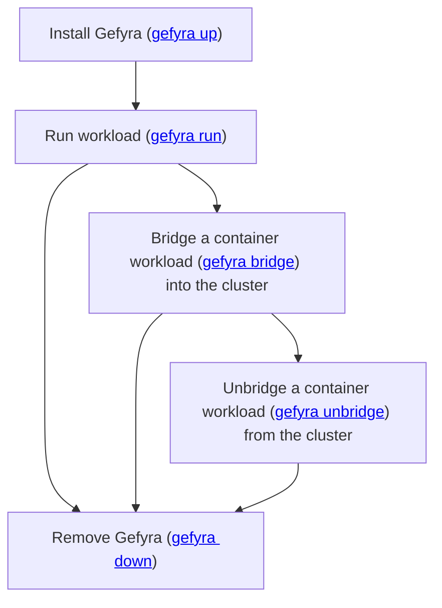

## Workflow for single users
This workflow with Gefyra is an shortcut for local connections: `gefyra up` takes care of creating a *default* [Gefyra Client](/en/shared-environments/clients), generating the connection configuration and setting up the connection to the cluster.

TODO: flowchart support

## Local Kubernetes providers

Follow along these guides to connect Gefyra with your preferred Kubernetes provider.

:::card-group
  ::card
  ---
  title: Colima Kubernetes
  icon: i-simple-icons-kubernetes
  to: /en/local-environments/colima
  ---
  This guide will show you how to use Gefyra for the local development of a Kubernetes application running in Colima Kubernetes.
  ::

  ::card
  ---
  title: Docker Desktop Extension (OSX)
  icon: i-simple-icons-docker
  to: /en/local-environments/docker-desktop-extension
  ---
  This example is really similar to the k3d getting started guide.
  ::

  ::card
  ---
  title: k3d
  to: /en/local-environments/k3d
  ---
  This guide will show you how to use Gefyra for the local development of a Kubernetes application running in k3d.
  ::

  ::card
  ---
  title: kind
  to: /en/local-environments/kind
  ---
  This guide will show you how to use Gefyra for the local development of a Kubernetes application running in kind.
  ::

  ::card
  ---
  title: Minikube
  icon: i-simple-icons-kubernetes
  to: /en/local-environments/minikube
  ---
  Please refer to the general getting started guide for Gefyra as this is about Minikube, too.
  ::
:::

Hey! We would be very happy to know about your Kubernetes development setup. If you can't find your distribuition in this
list, please request a guide by creating [a GitHub issue using this template](https://github.com/gefyrahq/gefyra/issues/new?assignees=&labels=enhancement&template=guide-request.md&title=%5BGuide+request%5D%3A+){target="_blank"}.  
It's that simple and very helpful.