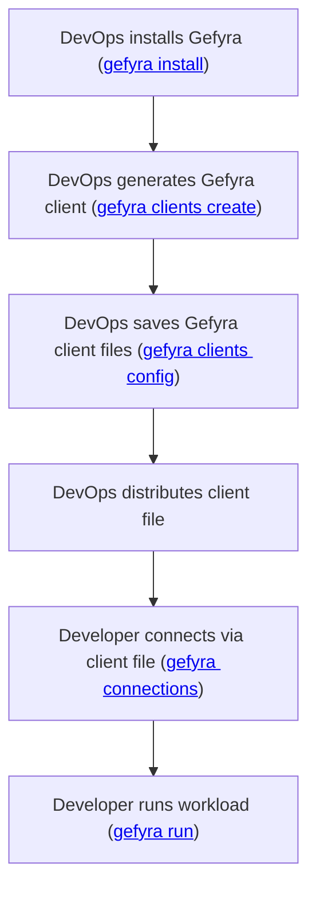

::note
Gefyra Clients provide a way to grant multiple clients (i.e. users, robots, pipelines, etc.) limited access to a Kubernetes cluster in order to use Gefyra's capabilities. They are managed with [gefyra clients [COMMAND]](/en/quick-start/cli#clients).
::

## Shared Cluster Access

Each created client object get a dedicated *Kubernetes Service Account* attached that is being used by any Gefyra client during its interaction with the cluster. The corresponding *client file*, which contains the connection parameters for the *Service Account* can be retrieved from the cluster by the administrator with Gefyra's CLI.  

This client file can be then distributed to anyone which needs to `connect`, `run` or `bridge` workloads in the given cluster.
The permissions of the Kubernetes service account are limited, following the principle of the least privilege. Hence, Gefyra clients can only operate in the cluster with the well-defined set of Gefyra's actions.

This flow gives a brief overview of Gefyra's workflow for teams:

<!-- TODO: add flowchart support -->



::warning{:title="Don't share client connections"}
Although clients may be used by multiple machines, it is neither recommended not will it work simultaneously. Once a client connects to a cluster, it agrees with Gefyra's Operator on a dedicated IP-range that no other client can use at the same time. Clients may connect and disconnect at any time. When disconnecting from the cluster, clients release their VPN peer (and thus their IP-range) association.
::

## Prerequisites

- Gefyra is [available](/en/quick-start/installation) (at least in version 2.0.0)
- Gefyra is [installed](/en/shared-environments/installation) to a shared Kubernetes cluster
- Admin access to the shared cluster

## Creating a Gefyra Client

You can create as many clients as you need in a cluster. Every client will have it's very own VPN connection to the cluster.  
An admin manages clients via Gefyra's `gefyra client` command group in the CLI. Gefyra operates with the currently active cluster context on the machine it is running on.

::note
Check your active cluster context with `kubectl config current-context`.
::

::code-preview
```
Manage clients for a Gefyra installation

Commands:
  config (write)      Get a Gefyra connection config for a client
  create              Create a new Gefyra client
  delete (rm,remove)  Mark a Gefyra client for deletion
  inspect (show,get)  Discribe a Gefyra client
  list (ls)           List all Gefyra clients
```

#code
```sh
gefyra client
```
::

You can create one client object with:

::code-preview
`1 client(s) created successfully`

#code
```sh
gefyra client create
```
::

That command created a randomly named client in your cluster. You can find it with:

::code-preview
```
ID                                STATE                        CREATED
20d50da476524eaf8dd511deed55fc63  GefyraClientState.REQUESTED  Creating...
```

#code
```sh
gefyra clients ls
```
::

Once the client is ready, you will find the following output:

::code-preview
```
ID                                STATE                      CREATED
20d50da476524eaf8dd511deed55fc63  GefyraClientState.WAITING  2023-10-06T15:21:19.771717Z
```

#code
```sh
gefyra clients ls
```
::

The client is now in the waiting state and ready for connection.

To manage human-readable clients, you can set the client name with:

```sh
gefyra clients create --client-id my-fancy-client
```

or create many clients at once using:

```sh
gefyra clients create -n 10
```

This will create a set of 10 clients in the cluster.

## Retrieving a _Client File_

Gefyra clients require a client file to connect to this cluster. The admin is responsible to fetch these client files and distribute them to other machines, developers, etc.

### A Default Client File

The following command prints the client file of the selected client to the console:

::code-preview
```json
{"client_id": "20d50da476524eaf8dd511deed55fc63", "kubernetes_server": "https://<redacted>", "provider": "stowaway", "token": "<redacted>", "namespace": "<redacted>", "ca_crt": "<redacted>", "gefyra_server": "<redacted>:31820"}
```

#code
```sh
gefyra clients config 20d50da476524eaf8dd511deed55fc63
```
::

As you can see, the *client file* is JSON-structured and contains a lot of secret information. Especially the 
*access token* of the Kubernetes service account that is associated with this Gefyra client, but also the other connection
parameters are **highly sensible**.

::note
Please handle the _client files_ with care as they contain confidential information. Leaking these files may allow unidentified individuals access to your Gefyra cluster.
::

You can either pipe that output to a file on your local machine:

```sh
gefyra clients config 20d50da476524eaf8dd511deed55fc63 > 20d50da476524eaf8dd511deed55fc63.json
```

or use the _output flag_

```sh
gefyra clients config 20d50da476524eaf8dd511deed55fc63 -o 20d50da476524eaf8dd511deed55fc63.json
```

in your current working directory.

### Providing Custom Connection Data

::note
In this process, Gefyra tries to determine as many connection parameters as possible automatically. However, if there are network-related customizations to made for your client, please provide them at this point.
::

If you need to specify the connection endpoint for Kubernetes differently, please use the `--kubernetes-api` option, e.g.

```sh
gefyra clients config 20d50da476524eaf8dd511deed55fc63 --kubernetes-api "https://k8s.blueshoe.io"
```

If you need to specify Gefyra's VPN connection endpoint, please use the `--host` and/or `--port` option, e.g.

```sh
gefyra clients config 20d50da476524eaf8dd511deed55fc63 --host 192.169.0.1
```

This data will be written into the `client file` so that your clients can connect to the cluster using these parameters. If you fail to provide correct data to your clients, they might be unable to connect to the cluster.

### Distributing the Client File

This _client file_ is all a Gefyra client needs in order to establish a connection. Of course, you are free to distribute these files any way you want, but please keep in mind the security implications.

## Deleting a Gefyra Client

You can delete a Gefyra client in every stage of its lifecycle. This will disconnect the client (forcefully) and render its client file invalid, thus the owner of the file will no longer be able to connect to the cluster.

::code-preview
`Client 20d50da476524eaf8dd511deed55fc63 marked for deletion`

#code
```sh
gefyra clients delete 20d50da476524eaf8dd511deed55fc63
```
::

When you delete a Gefyra client, its credentials are also irretrievably deleted.